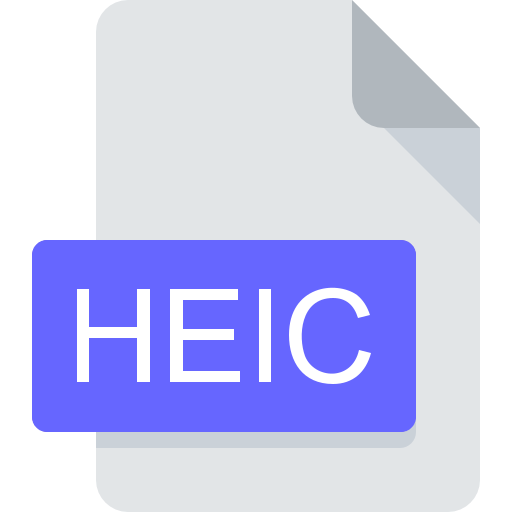

# dkb-heicToPngConverter
<!-- Conversion script which converts '.heic' files, to '.png' files without quality compression -->

<p align="center">



</p>

## Description

The HEIC to PNG Converter is a Node.js application designed to batch convert HEIC (High-Efficiency Image Coding) files to PNG (Portable Network Graphics) files. This tool is particularly useful for users who need to handle images from Apple devices, as HEIC is the default format for photos on iOS.

## Getting Started

### Dependencies

* `sharp` : A high-performance image processing library.
* `heic-convert` : A library to decode HEIC files using libheif.
* `cli-progress` : A library to display progress bars in the terminal.

### Installation
1. Clone the Repository

``` bash
git clone https://github.com/dkbozkurt/dkb-heicToPngConverter.git
cd heicToPngConverter
```

2. Install Dependencies

```bash
npm install
```

3. Project Structure
Ensure you have the following structure:

```bash
heic-to-png-converter/
├── source/         # Folder containing source .heic files
├── dist/           # Folder where converted .png files will be saved
├── convertHeicToPng.js  # The main conversion script
└── package.json    # Project configuration and dependencies
```

### Usage

1. Place your .heic files in the source folder.
2. Run the Conversion Script
```bash
npm run dev
```
This command will convert all .heic files in the source folder to .png files in the dist folder, keeping the original filenames. It also displays a progress bar to show the conversion progress.


## Example

If you have a file <b>image1.heic</b> in the source folder, running the script will create a <b>image1.png</b> file in the dist folder.

## Notes
* Ensure the source and dist folders are in the same directory as the convertHeicToPng.js script.
* The conversion process may take some time depending on the number and size of .heic files.
* Test '.heic' files can be found under <b>/heicToPngConverter/test/</b>.

## Authors

Contributors names and contact info

* Dogukan Kaan Bozkurt [@dkbozkurt](https://github.com/dkbozkurt)

## Version History

* 0.1
    * Initial Release
* 0.2
    * Added progress bar functionality and improved error handling.

## License

This project is licensed under the MIT License - see the LICENSE.md file for details

## Contributing

Contributions are welcome! Feel free to open an issue or submit a pull request.